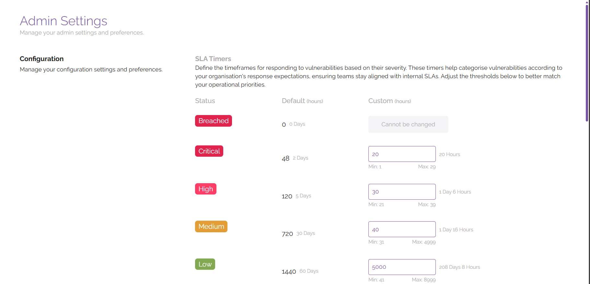

# Admin Settings

The Admin Settings section of the platform is used to control administrative items related to how vulnerabilities are handled on the platform. Key components are the ability to create and manage tags for assets and vulnerabilities, manage integrations, and configure SLA timers for different vulnerability severities.

## SLA Timers
SLA timers are used to define the timeframes for responding to vulnerabilities based on their severity. These timers are used to categorise vulnerabilities according to your organisation's procedures around response times to vulnerabilities, ensuring that teams stay aligned with internal SLAs.

ClearFix comes preconfigured with standard SLA timers by severity, outlined below:

- Breached – 0 hours
- Critical – 48 hours (2 days)
- High – 120 hours (5 days)
- Medium - 720 hours (30 days)
- Low - 1440 hours (60 days)
- Info - 8760 hours (365 days)

Using the data entry fields next to the corresponding severity levels, you can adjust the SLA timers by either entering your own values or using the arrows to increase or decrease the timers accordingly. We would advise that you refer to any internal policies and procedures you have for handling vulnerabilities for reference around SLAs to ensure alignment between teams who may be seeking to mitigate or manage vulnerabilities.

## Tags
ClearFix allows users to create custom tags to be used across the platform. This can be helpful for identifying items which operate in a specific environment (e.g., tags to denote production and staging systems), or to draw attention to certain items (e.g., tags that specify which vulnerabilities are a priority).

To create a tag, enter a tag name in the clearly labelled field, then hit the ‘+’ button to add the tag to the platform. You can remove existing tags by filtering through the list of tags shown below and clicking the ‘Delete’ button next to the tag you wish to remove.

## Global Integrations
The Global Integrations section is used to manage integrations for apps that are linked at a platform level. To create an integration with Jira for the creation of tickets from the ClearFix platform as part of your workflows, enter the following details in the labelled fields:

- Email Address
- Site Name
- Project Key
- API Token

After filling out the stated fields, click on the ‘Test Connection’ button to ensure that the connection is valid and establish a link with Jira via the API. After this, click ‘Update’ to save your changes.
