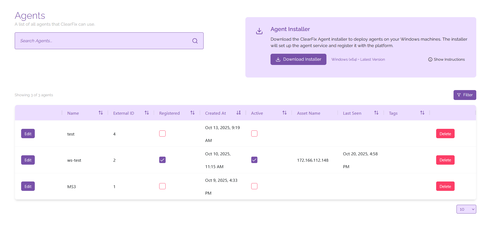
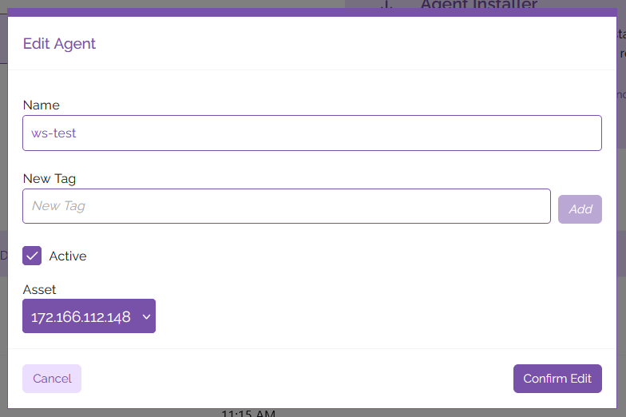

# Agents

Agents are used by ClearFix to automatically push fixes to devices on your tenancy. You can create an link agents to assets that have generated by your vulnerability scans by installing the ClearFix agent on the device of your choice, then the agent can be associated with the asset you are deploying a fix for.

## Creating Agents
To create an agent, you must first download the Agent Installer for your device. Currently agents are only available for Windows x64 systems. Click the button labelled 'Download Installer' to begin downloading the installer for your device.

Once the installer has finished downloading, extract the executable file to the device you would like to install the agent on. From here you can either double-click on the file to open the installer, or run it from the command line using the command `.\ClearFix.Agent.Installer.exe install <agentApiKey>` run from the same directory the executable file is stored in.

When the installer opens you will be prompted to select your API URL and the directory you wish to install the agent in; when prompted, you may answer yes to either question regarding the default directory or API URL to use a custom directory or custom API URL, however in most cases the default URL and install directory will suffice for an install. You'll also be prompted to input your agent API key - you can find this in the Platform Admin section of the application under your accounts.

After you've input the prerequisite information, the agent will begin installing. Once the install is complete, it will show up in the list of agents present on your tenancy.

## Managing Agents

### Editing Agents
On the page you will see a list of all the assets you currently have linked to your tenancy. From here you can edit your assets, changing the following information:

- Name/type of asset
- Platform association
- Platform identifier
- Tags

To edit this information, click on the 'Edit' button next to the agent you wish to edit listed on the page. From here you can edit the fields to rename, tag, or mark the asset as active/inactive. To associate the agent with an asset, click on the dropdown list under the 'Asset' heading and select the asset you wish to associate with the agent. When you're happy with your changes, click 'Confirm Edit' to save your changes.

### Updating Agents
To update the ClearFix agent on a device, you can use the ClearFix installer. Run the installer script on the device you wish to update, then when prompted to select which action you wish to perform, type 'update'. This will prompt the agent to update based on the latest configuration available.

### Uninstalling and Deleting Agents
Uninstalling agents can also be done using the ClearFix installer. Run the installer script on the device you wish to uninstall the agent from, then when prompted to select which action you wish to perform, type 'uninstall'. This will prompt the agent to be uninstalled from the device.

This action will unregister and deactivate the asset on the ClearFix platform, however you may have to remove the agent from the list manually. To do this, find your agent on the list of agents displayed, the click the 'Delete' button to the right of the list item.