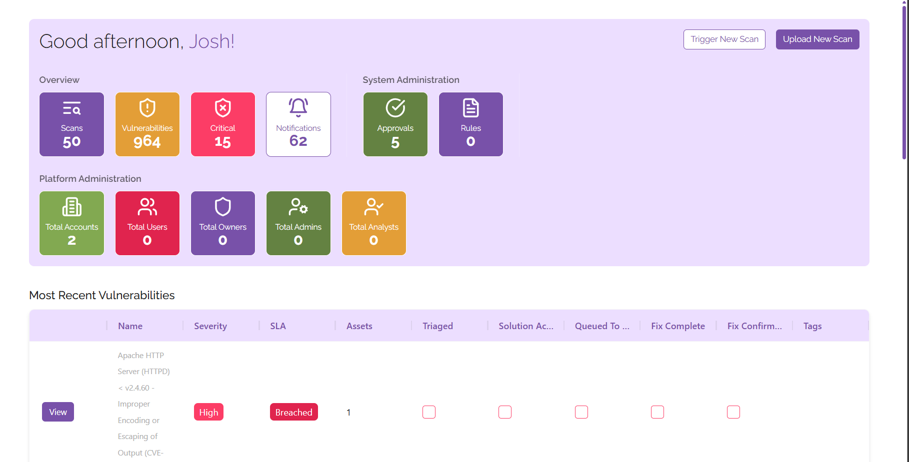

# Dashboard

The dashboard allows you to view all of the critical information for your digital estate in one place, understand what you need to prioritise at a glance. From here you can find:

- Statistics
	- See all of your vulnerabilities, scans, critical level vulnerabilities, and notifications
	- See any administrative items that need to be actioned
	- See information relevant to administering the platform, including user counts and a breakdown of users by type
- Vulnerabilities
	- See all your most recent vulnerabilities in one place
	- View the total number of vulnerabilities on your estate in the graph, you can change the view at any time to show vulnerabilities across the week or month-by-month
- Assets
	- See all of your assets in one place
	- Track the total number of vulnerabilities affecting each device so that you know what to prioritise
- Scans
	- View the progress of your scans at a glance
	- See which scans are running, which are complete, and judge which scans need attention
	- Trigger and upload results from new scans from the dashboard
