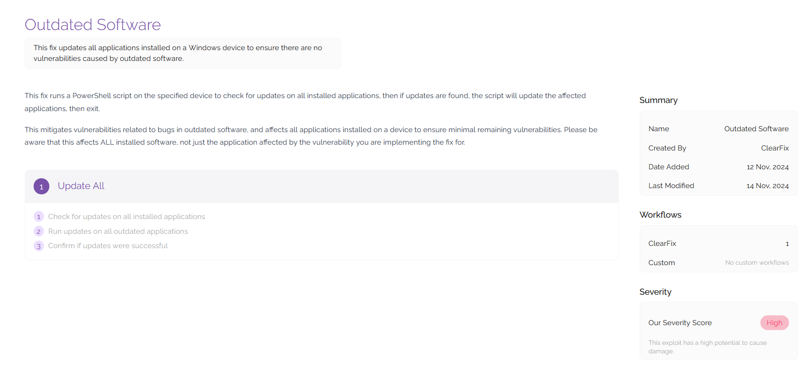

# Fixes
On this page you can view all of the fixes that are currently available in your ClearFix tenancy. Fixes are used to deploy code onto a machine in order to mitigate vulnerabilities that have been highlighted by scans and penetration tests. By viewing your existing fixes, you'll be able to gain a greater understanding of the tools you have available in the platform to fix issues on your digital estate, and assess whether an existing fix would be able to mitigate a vulnerability.

## Viewing Fixes

Viewing a fix will give you detailed information around the fix including information about the vulnerability and how it can be mitigated. This page will list a description of the fix as well as an overview of how it works. You can edit the text on this page using the Fix Management tool (outlined in Platform Admin).

You can also view workflows in this section to understand how the fix will be deployed when remedial steps are undertaken against an asset. To view the workflows and the code that allows them to run, click on the workflow shown towards the bottom of the screen.

By navigating to the code you wish to view using the directory view on the left hand side of the screen, you will be able to view the code that is being run for the fix. Sometimes a fix that is made for one vulnerability may have additional utility, so it's always worth seeing what is in the platform for you to use when deploying fixes. For example, a fix that contains code which updates all outdated software on a machine may be applicable for any vulnerabilities relating to outdated software.

## Video Demonstration
The following video shows the process for pushing a fix to an agent to remediate a vulnerability.

