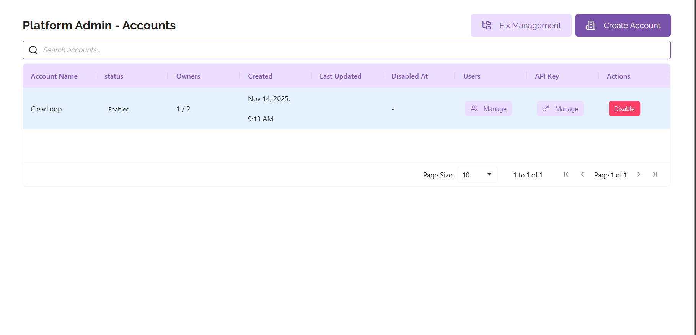
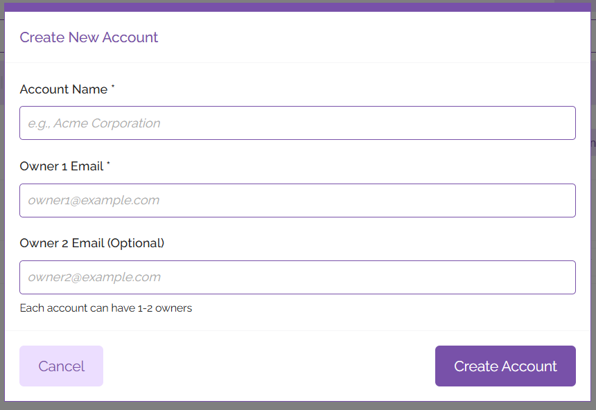
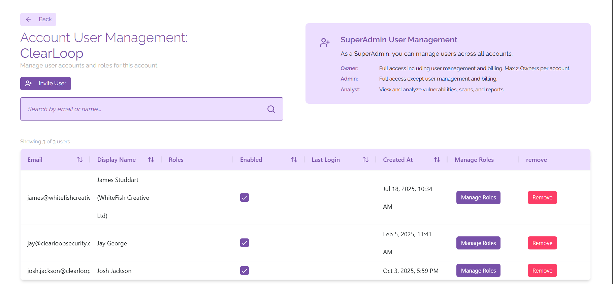
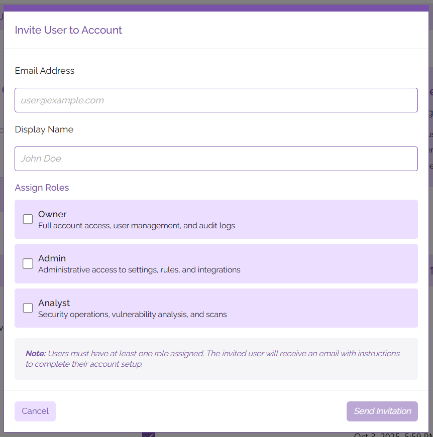
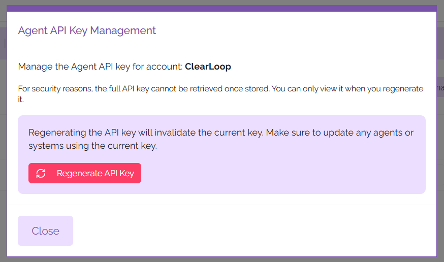
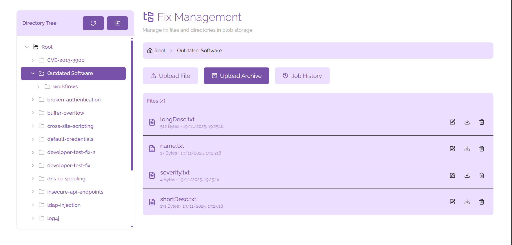
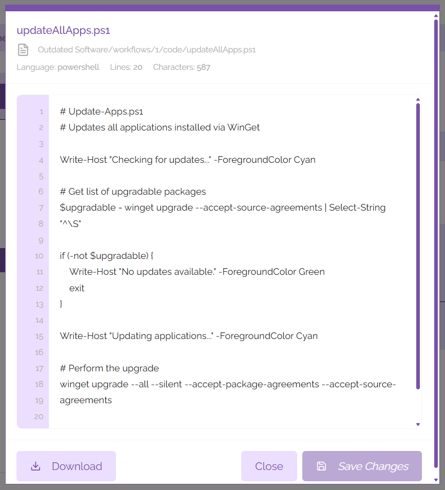

# Platform Admin

From the Platform Admin panel, you can create and manage accounts and fixes.

## Account Management
To create an account, click the ‘Create Account’ button at the top right corner of the panel. From here you’ll be prompted to name your account, including adding an email address for the account owner. You can also add a second email address for a second account owner. Each account can have up to two owners.

After entering this information, click the ‘Create Account’ button. Your new account should show up in the list of accounts displayed on the Platform Admin pane.

### User Management

From the Platform Admin section, you are able to manage the users who have access to your account. To do this, find the account you wish to view the users for and under the 'Users' heading click 'Manage'. 

To invite a new user to the platform, click on the 'Invite User' button. In the context window that opens, you can input the following information:

- Email Address
- Display Name
- Assigned Roles

After entering this information, click on the 'Send Invitation' button. The user will receive an email with information on how to sign in to their account and start using ClearFix.

If you wish to change the roles of an existing user, you can click on the 'Manage Roles' button next to their name in the list of users shown on the page. From here you will be able to assign and revoke access to different roles, as well as deactivating the user's account so that they are not able to access the platform from that account without deleting their account outright.

If you would like to delete a user's account from the platform, click on the button labelled 'Remove' next to their name in the user list. This will remove the user's account from the ClearFix platform.

### API Management
Under the API Key column in the list of accounts, click on the button labelled 'Manage'. This will open a context window that allows you to manage the API key for your ClearFix tenancy. API keys are used to create agents on your digital estate, allowing for fixes to be automatically pushed from the platform to your vulnerable devices.

For security reasons, it is only possible to view the API key immediately after it has been regenerated. To regenerate the API key, click on the 'Regenerate API Key' button and make note of the key that is displayed. You may wish to store this in a secure location such as a secrets management application.

Please note that any agents using the previous API key will need to be updated before they can be used again. To do this, run the update utility on your ClearFix agents using the ClearFix Installer.

## Fix Management

To access the Fix Management panel, click on the ‘Fix Management’ button on the Platform Admin panel. This opens a directory of all fixes that are currently catalogued or available to be pushed to endpoints via the ClearFix platform.

### Fix Structure
Each fix consists of the following directory structure (directories are shown in bold):

- **Fix Name**
	- Name of Vulnerability
	- Severity of Vulnerability
	- Long Description of Vulnerability
	- Short Description of Vulnerability
	- **Workflows**
		- **1 (number represents the number of workflows available)**
			- Name of Workflow
			- Steps of Workflow
			- **Code (contains code for the fix)**
				- Readme.md
				- Code for deploying the fix (ps1, py, or sh format)
		- **2**
			- Name of Workflow
			- Steps of Workflow
			- **Code (contains code for the fix)**
				- Readme.md
				- Code for deploying the fix (.ps1, .py, or .sh format)

From this view you can upload new files to the directory tree for specific items you wish to add to your fixes, or you can upload full directories in .zip format that will be unzipped to insert directly into the directory structure. Files and directories will be uploaded to the directory you are currently viewing; if you wish to upload a new fix to the root directory, navigate to the root directory before uploading an archive.

## File Management
Using the directory tree view you can view all of the fixes that you have in the platform. Clicking on a directory will show you all of the files that are contained within it. From here you can edit, download, or delete any existing files.

### Files

Files can be edited by clicking the pencil icon next to their file name. This will open a context window that allows you to make changes to the file; to save the file when you're done editing it, click the 'Save Changes' button.

You may wish to work on the file offline in your text editor of choice - to do this it is advisable to download the file. You can download the file by either clicking on the download icon next to the file name, or by editing the file and clicking on the button labelled 'Download'.

If you wish to delete a file, click on the bin icon next to the file name. This will remove the file from your fix management directory.

### Directories
As shown above, each fix is divided into a series of directories and files to ensure segmentation of workflows in a way that is easily interpreted on the ClearFix platform. To create a new directory, click on the folder icon shown at the top of the directory tree (hovering over the icon will clarify that this button means 'Create new folder'). You can name this folder using the context window that is shown after clicking on the icon. When you're happy with the name you've chosen for the folder, click on the button labelled 'Create'. This directory will appear in the directory tree created under the root directory, you'll be able to use it imminently.

If you wish to create a subfolder, click on the folder you want to create a subfolder in and hover your mouse over the name. This will show context buttons that allow you to create a subfolder, rename the folder, or delete the folder.

## Job History
If you are uploading a large directory full of fixes and fix details the upload may take some time. You can use the Job History tab to track the progress of uploads while they are taking place.

To access the Job History tab, click on the 'Job History' tab to see all of the Fix Management related work. When you're done viewing the Job History, click on 'Hide Job History' and you will be returned to the regular directory view.