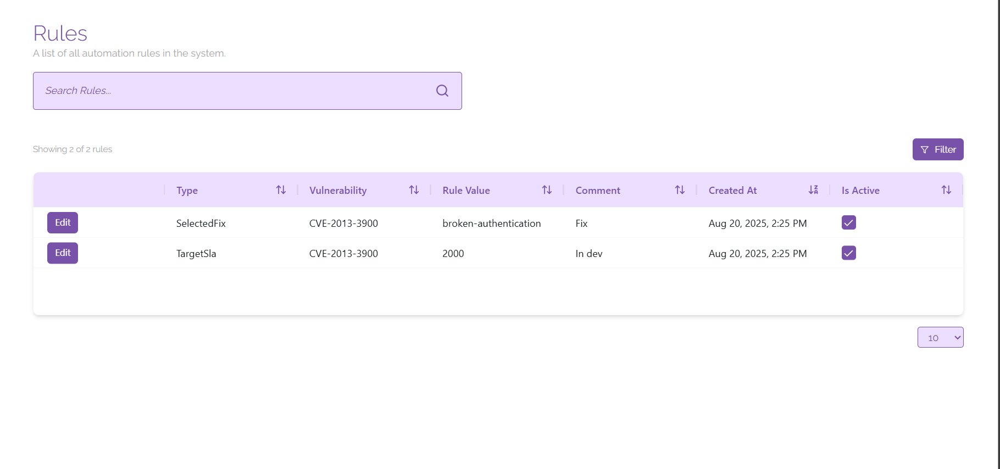

# Rules

Rules are created to indicate when you want a persistent change to be made for an asset or vulnerability, for example if you want to permanently modify the severity of a vulnerability, or mark a vulnerability for a specific asset as a false positive indefinitely, you can do this on the vulnerability page and manage those rules here.

## Managing Rules
On this page you will see a list of all of the rules that are present in the platform presented in the table. You can sort, search, and filter the table using the provided sorting buttons, search bar, and filter button to show you any specific rules that you may be looking for.

Rules can remain in the platform while inactive to cover situations where your organisation needs to disable the rule temporarily. This is covered under rule management.

To edit a rule, click on the ‘Edit’ button next to the rule you would like to edit. From here you can view all of the information relating to the rule and mark it as inactive if necessary. To do this, click the ‘Deactivate’ button at the bottom of the pop-up window showing the vulnerability details; you can reactivate the rule in the same manner.

To delete a rule, click on the ‘Edit button next to the rule you would like to delete. From here, click on the ‘Delete’ button at the bottom of the pop-up window for the vulnerability; this will permanently delete the rule from ClearFix.
