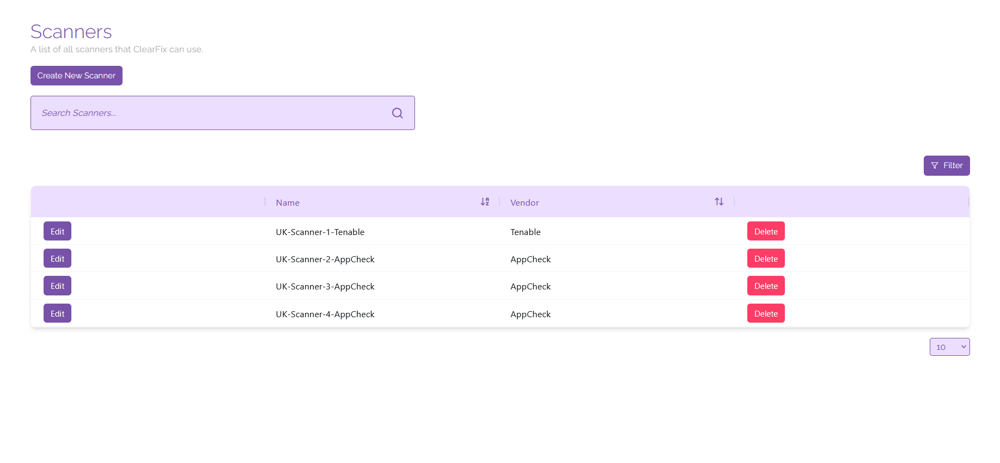

# Scanners

Here you can link scanners from popular vulnerability scanning platforms like Tenable and AppCheck; this is required for you to be able to launch scans from the ClearFix platform.

## Creating Scanners
To create a new scanner, click on the button labelled 'Create New Scanner'. From here, name your scanner and select the platform it will be linked to from the drop down list labelled 'Vendor'.

If you have selected Tenable, you will need to provide your access key and secret key to link the scanner to the ClearFix platform. If you have selected AppCheck, you will need to provide your API key to link your scanner.

When you have entered all of the relevant information into the context window, click on the button labelled 'Create' to create a new scanner. You can launch scans from this scanner using the Scans Overview page.

## Managing Scanners
You are able to edit information associated with a scanner on this page including the name and platform association of a specific scanner. To do this, click on the ‘Edit’ button next to a scanner, then input the relevant information to better identify the scanner that you are using.

If you are dealing with a large number of scanners, you can sort and filter your view to match specific parameters. To do this, either click on the arrows next to the heading of any column in the view, or click on the ‘Filter’ button and input the relevant filter information required.

If you need to delete a scanner, click on the ‘Delete’ button next to the scanner you wish to delete. This will remove the association with the scanner on its platform and prevent it from being displayed in the ClearFix platform (this will not delete scanners on the vulnerability scanning service you are using).
