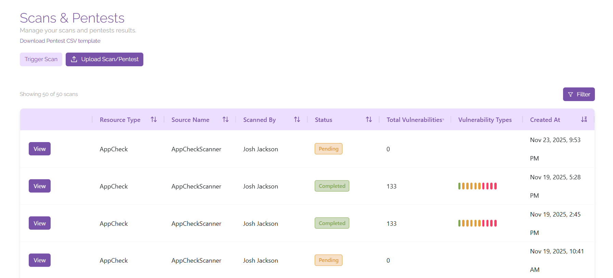
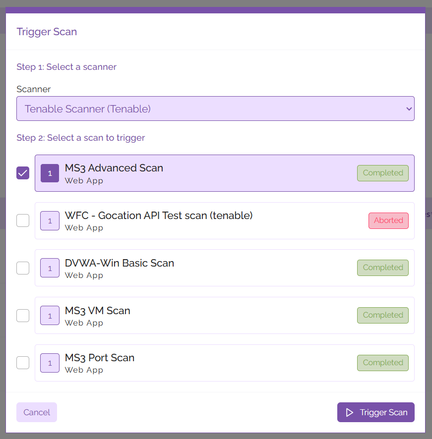
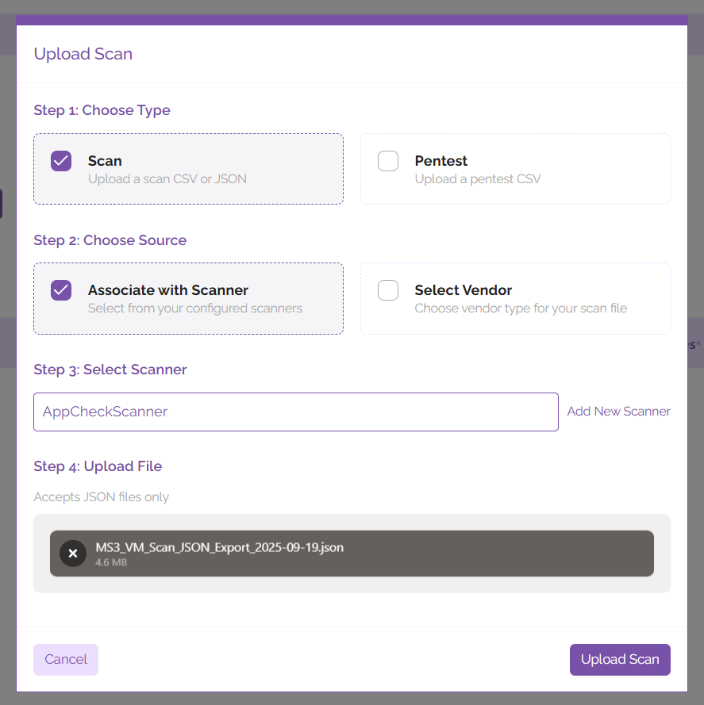

# Scans

The scans page allows you to create and manage scans across your vulnerability scanning tools from within ClearFix, as well as import penetration test results so that you have complete visibility over the vulnerabilities that are affecting your digital estate.

## Triggering Scans

Trigger a scan at any time from this screen, simply click ‘Trigger Scan’, select your preferred scanner, select the scan you would like to launch, then hit ‘Trigger Scan’.

Once your scan has initiated, it will show up in the list of scans shown on the page with its corresponding status. When your scan has completed it will show in the list of scans, click ‘View’ to view the vulnerabilities that have been detected.

## Upload Results
Alongside integrating seamlessly with many popular vulnerability scanning services, ClearFix also allows users to upload results from existing scans and penetration tests.

### Scan Results

To upload results from an existing scan, click ‘Upload Scan/Pentest’. In the window that pops up, select ‘Scan’, then select your source. Your source could either be an existing scanner, or a vendor – select the relevant source with the tickboxes for ‘Associate with Scanner’ or ‘Select Vendor’, then enter the information for your scanner/vendor in the text field below. After this, upload the CSV or JSON file containing your scan results and let the platform do the rest.

### Penetration Test Results
To upload penetration test results, click on the text that says ‘Download Pentest CSV template’. Penetration test results must be formatted before uploading to ClearFix; review the results of your penetration test and input them into the template so that they can be processed by ClearFix in the correct manner. Alternatively, you may wish to request that your penetration tester provides you with the results of your test in the ClearFix Pentest CSV format.

Once these results have been formatted, they are ready to be uploaded. Simply click on the ‘Upload Scan/Pentest’ button, then select ‘Pentest’ as the type of data that you’ll be uploading. Browse for the CSV file containing the pentest results after this and upload it to the grey box marked for uploading your files, then click ‘Upload Pentest’. You should see the results populate shortly once the platform has finished processing them.

## Video Demonstration

The following video shows the process for launching a scan in ClearFix.

