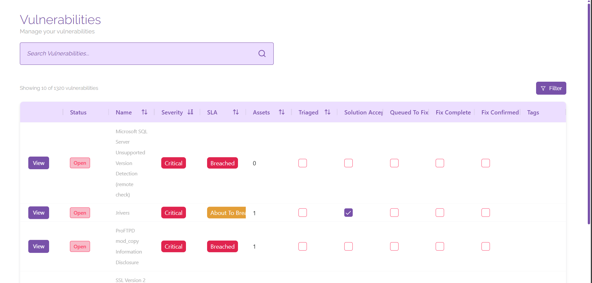
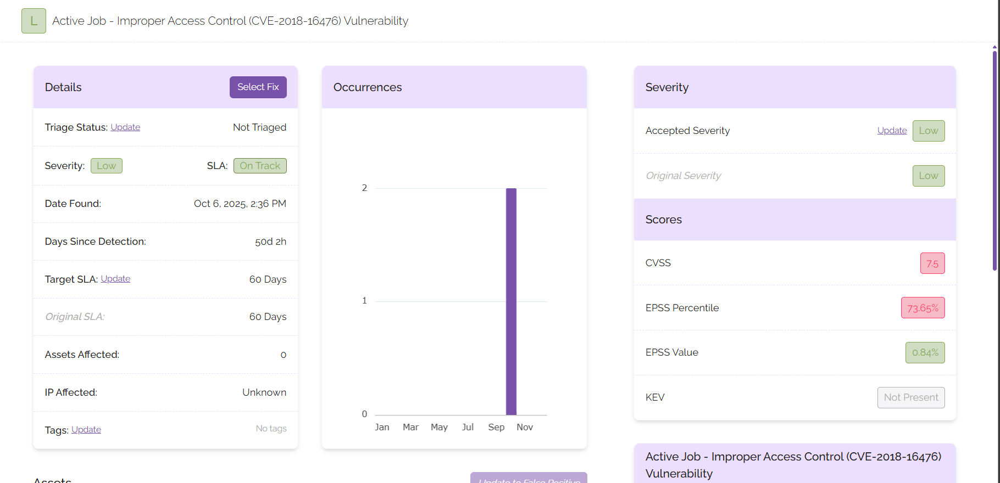

# Vulnerabilities

## Managing Vulnerabilities
On the overview page, you’re able to sort, filter, and view your vulnerabilities to find specific items that may require your urgent attention. You will be able to see all of the necessary information for each vulnerability at a glance to ensure that you are complying with your SLAs and vulnerability management procedures.

Closed vulnerabilities are hidden by default to direct your attention to vulnerabilities that are a priority. If you need to include closed vulnerabilities in your view, click ‘Filter’ then click the toggle button next to ‘Include Closed Vulnerabilities’.

## Viewing Vulnerabilities

To view a vulnerability in more detail, click on the ‘View’ button next to any vulnerability.

From this screen you will be able to manage and view details associated with the vulnerability you selected, including the following:

- Name and details of the vulnerability
- Severity information
- Number of occurrences
- Description of your vulnerability
- Assets affected by the vulnerability
- Advice on how to mitigate the vulnerability
- History of comments or actions associated with the vulnerability

## Managing Vulnerabilities
From the vulnerability page, you will be able to:

- Update the accepted severity
- Mark assets as being a false positive
- Tag the vulnerability
- Select advice to proceed with the fix for the vulnerability
- Update SLAs
- Triage the vulnerability
- Select a fix for the vulnerability

Performing these actions will trigger an approval process for the administrator of your platform. Your administrator will receive a notification telling them that they have items to approve. Once all necessary items are approved, mark the vulnerability as triaged and proceed to either select a fix or continue with the vulnerability marked as a false positive. When the vulnerability has been mitigated, you can close it from this page using the button that will appear on the top right corner of the screen.
